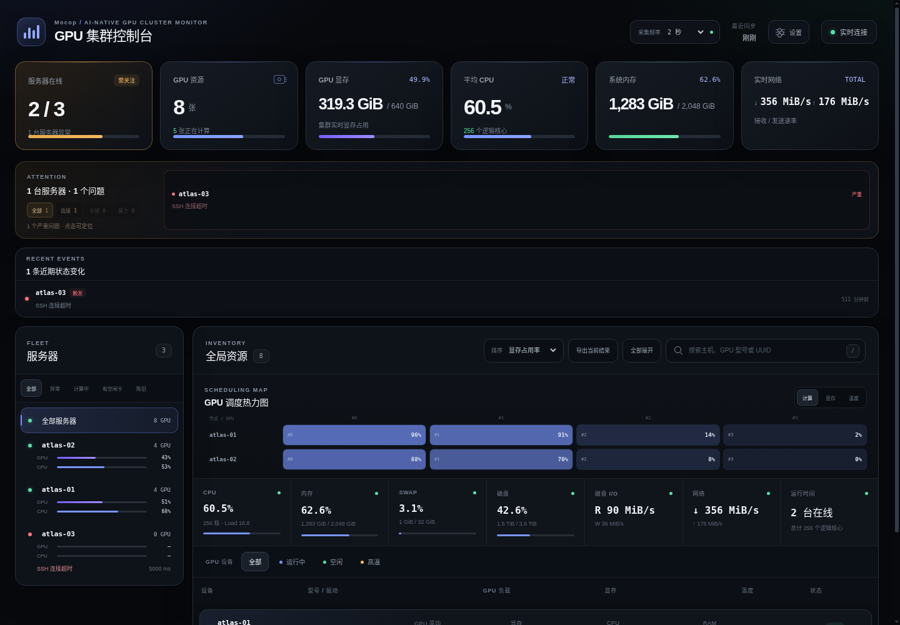

<p align="center">
  
</p>

<h1 align="center">Mocop</h1>

<p align="center">基于 OpenSSH 的 AI-native GPU 集群监控</p>

<p align="center">
  <a href="README.md">English</a> · <a href="README.zh-CN.md">简体中文</a>
</p>

<p align="center">
  <a href="https://github.com/ChangWinde/mocop/actions/workflows/ci.yml"></a>
  
  <a href="LICENSE"></a>
  
</p>

<p align="center">
  <a href="#快速开始">快速开始</a> ·
  <a href="#配置">配置</a> ·
  <a href="#故障行为">故障排查</a> ·
  <a href="#安全">安全</a>
</p>



Mocop 是面向 NVIDIA GPU 集群的本地网页监控工具。它复用已有 OpenSSH 别名，采集 GPU、CPU、内存、Swap、磁盘和网络数据，并在每台主机完成采集后立即将结果推送到浏览器。

远端主机不需要安装 Agent、数据库、Python，也不需要开放监控端口。远端只需提供 Linux `/proc`；需要 NVIDIA GPU 数据时还需提供 `nvidia-smi`。Mocop 本身只使用 Python 标准库和系统 OpenSSH 客户端。

这里的 **AI-native** 是指界面围绕 GPU 容量、任务放置和故障定位设计。Mocop 不调用 AI 服务，也不上传遥测数据。

## 功能

- GPU 利用率、显存、温度、功耗、型号、驱动、硬件健康和每卡进程
- GPU 算力匹配、调度热力图、连接拓扑、搜索、筛选和 CSV 导出
- CPU、Load、内存、Swap、磁盘容量与 I/O、网络速率和运行时间
- 带诊断、确认/静默、分级阈值、防抖处理和定时维护的告警
- 节点级独立调度、可能的共享链路聚合和可选 HTTPS Webhook
- 基于配置的节点资产、预期 GPU 数、本机采集和节点分组
- 单卡趋势和进程时间线，以及可选的有界 SQLite 留存与只读 Slurm/Kubernetes 上下文
- 六种视觉风格、六种独立主题色、紧凑模式、排序记忆和经过校验的本地背景
- 可供 Prometheus 和 Grafana 使用的 OpenMetrics 1.0 端点

## 快速开始

Mocop 需要 Linux、Python 3.10 或更高版本、OpenSSH，以及对每台远端节点的非交互式 SSH 访问。启用无人值守采集前，请人工核对主机指纹。

下面的步骤使用 [uv](https://docs.astral.sh/uv/) 安装 Mocop。如果尚未安装 uv：

```bash
curl -LsSf https://astral.sh/uv/install.sh | sh
```

Mocop 以用户级 systemd 服务运行。未启用 linger 时，用户服务会随登出立即停止；执行一次以下命令，让监控在登出后继续运行：

```bash
loginctl enable-linger "$USER"
```

### 1. 配置 SSH

在 `~/.ssh/config` 中为每个计算节点添加一个明确别名：

```sshconfig
Host gpu-node-01
    HostName 192.0.2.10
    User cluster-monitor
    IdentityFile ~/.ssh/id_ed25519
    IdentitiesOnly yes
```

上面的地址只用于文档示例。替换为实际主机后验证连接：

```bash
ssh gpu-node-01 true
ssh -o BatchMode=yes gpu-node-01 true
```

`ProxyJump`、端口、用户和身份文件应继续由 OpenSSH 管理。不要把跳板机或 Git 远端加入 Mocop 的被监控 `hosts` 列表。可选的展示拓扑可以呈现跳板机和 FRP 节点，但不会采集它们。

### 2. 安装并初始化

```bash
uv tool install git+https://github.com/ChangWinde/mocop.git
mocop init --host gpu-node-01 --host gpu-node-02
```

`mocop init` 会创建权限为 `0600` 的 `~/.config/mocop/config.json`。它只监控通过 `--host` 指定的别名，关闭自动发现，并将采集周期设为 5 秒。

### 3. 校验配置与 SSH 路径

```bash
mocop config check
mocop doctor
```

`mocop config check` 只解析并校验配置，不启动网页服务，也不打开任何 SSH 连接。它报告解析到的配置路径、主机数量、持久化/工作负载/拓扑状态，以及每个 webhook 引用的环境变量名及其 set/unset 状态——绝不输出变量值。配置有效时退出码为 `0`，无效时为 `2`。

随后 `mocop doctor` 验证每个受监控别名的非交互式 SSH 可达性与连接复用（全部别名可用时退出 `0`，否则为 `1`）。

### 4. 启动控制台

```bash
mocop service install
```

打开 <http://127.0.0.1:8787>。该命令会安装、启用并立即启动用户级 systemd 服务，但不会修改系统的 linger 策略。

直接运行 `mocop` 可使用前台模式。后台服务可通过以下命令管理：

```bash
mocop service status
mocop service uninstall
```

## 配置

初始化生成的文件已经包含全部字段。只有在网页未提供对应设置时才需要直接编辑。下面只展示主要资产字段：

```json
{
  "auto_discover": false,
  "hosts": ["monitor-host", "gpu-node-01", "gpu-node-02"],
  "exclude_hosts": ["gpu-bastion", "git-host"],
  "local_host": "monitor-host",
  "expected_gpu_counts": {
    "gpu-node-01": 8,
    "gpu-node-02": 8
  },
  "host_groups": {
    "gpu-node-01": "training",
    "gpu-node-02": "inference"
  }
}
```

- `hosts` 是明确的监控白名单，`exclude_hosts` 的排除优先级更高。
- `local_host` 指定 `hosts` 中唯一一台绕过 SSH、直接在本机采集的节点。
- `expected_gpu_counts` 用于发现 GPU 缺失。
- `host_groups` 用于共享节点分组。
- `host_overrides` 只用于调整经过测量的慢节点的采集周期或超时；可选的 `display_name` 为别名提供可读的列表显示名，不改变采集身份。
- `maintenance_windows` 每条要么给出一次性的 `until`，要么给出每周 `recurrence`（`{"weekday": 0-6, "start": "HH:MM", "duration_minutes": N}`，全部为 UTC，周一为 0）；周期窗口在每个实例期间静默可执行告警，采集持续进行。下面是一个完整示例：每周日 02:00–04:00 UTC 静默 `gpu-node-02`：

```json
{
  "maintenance_windows": {
    "gpu-node-02": {
      "reason": "weekly firmware maintenance",
      "recurrence": {"weekday": 6, "start": "02:00", "duration_minutes": 120}
    }
  }
}
```
- `gpu_process_poll_interval_seconds` 单独控制带时间戳的 GPU 任务刷新；默认 15 秒，核心 GPU 数据仍保持正常采集周期。
- `incident_overrides` 可按节点或分组覆盖有界阈值，并精确排除磁盘挂载点；节点配置优先。
- `thresholds.disk_min_free_gib`（默认 5）：文件系统在超过 `disk_warning_pct` 之后，若绝对剩余空间低于该 GiB 数即升级为 critical——这样"快满的 50 GiB 根分区"会排在"同样占比的 10 TiB 卷"之前。未超过百分比阈值的分区一律不升级，因此 `/boot/efi` 这类小分区不会误报。
- `incident_actions` 保存网页中的告警确认与静默及其 UTC 失效时间，通常由网页维护。
- `manual_probe_cooldown_seconds` 限制同一节点的手动探测频率；默认 5 秒。
- `retry_jitter_pct` 分散共享 SSH 路径故障后的重试；默认值为 15%。
- `topology` 描述连接树；其中的安全别名只有同时进入有效 `hosts` 清单时才会被采集。
- `persistence.enabled` 使用 SQLite 保留有界趋势和告警上下文；默认关闭。
- `workloads.mode: "identity"` 通过有界 `/proc` 读取补充进程属主（真实 UID 经 passwd 解析）、完整命令行与真实启动时间，成本约为 `"auto"` 的三分之一；`"auto"` 在此之上再识别 Slurm/Kubernetes 身份（cgroup 与环境读取）。两者默认均关闭；即使关闭，GPU 弹窗仍会显示每个进程"自监控观测起"的运行时长下限。工作负载身份采集每次样本最多覆盖前 512 个不同的 GPU 进程 PID。

Webhook 地址和签名密钥不写入 JSON。配置中只保存环境变量名：

```json
{
  "webhooks": [{
    "name": "operations",
    "url_env": "MOCOP_OPS_WEBHOOK_URL",
    "secret_env": "MOCOP_OPS_WEBHOOK_SECRET"
  }]
}
```

使用 `mocop service install` 时，在 `config.json` 同目录创建私有
`environment` 文件：

```bash
install -m 600 /dev/null ~/.config/mocop/environment
${EDITOR:-vi} ~/.config/mocop/environment
mocop service install
```

分别写入 `MOCOP_OPS_WEBHOOK_URL=...` 和 `MOCOP_OPS_WEBHOOK_SECRET=...`。
请使用真实密钥并保护该文件。Webhook 强制使用 HTTPS；访问私有网络需在
端点配置中明确允许。它支持故障开启、恢复、严重性变化、去重、节流和有界重试。

全部字段和安全范围见[完整配置示例](examples/mocop.example.json)。直接修改 JSON 后需要重启服务；网页中的修改会先校验，再原子写入，并立即生效。

### 哪些设置会保留

| 设置 | 保存位置 | 服务重启后保留 | 不同浏览器共享 |
|---|---|---:|---:|
| 采集周期、探测超时、并发数 | `config.json` | 是 | 是 |
| 监控节点、分组、维护和告警操作 | `config.json` | 是 | 是 |
| 可选节点/GPU 趋势及进程/告警转移 | 私有 SQLite 状态 | 是 | 是 |
| 视觉风格、主题色、密度、排序、筛选、GPU 列 | 浏览器 `localStorage` | 是 | 否 |
| 自定义背景 | 浏览器 `IndexedDB` | 是 | 否 |

只有清理当前浏览器的站点数据或恢复显示偏好时，浏览器设置才会丢失。移除自定义背景是单独操作。

网页允许设置 2–60 秒采集周期、2–300 秒探测超时（须大于连接超时，默认 5 秒）和 1–64 个并发 worker。周期越短、并发越高，SSH 和远端主机负载越大。

## 日常使用

- 点击 GPU 行或热力图单元格，查看当前进程、近期利用率/显存/温度/功耗趋势及进程进出记录。
- 打开告警查看基于证据的处理建议，再按固定时长确认或仅静默该条件。
- 在选中节点上使用“立即探测”，提前执行一次有界采集，不改变全局刷新周期。
- 使用“匹配算力”查找同一主机、同一型号且剩余显存足够的 GPU。结果不代表资源预留。
- 设置维护窗口后，采集继续进行，但对应问题不会进入待处理告警。
- 在“设置 → 监控节点”中扫描 SSH 别名，添加或删除符合条件的计算节点。
- 升级后可使用“设置 → 监控服务状态 → 重启服务”；该按钮只在用户级服务模式下可用，恢复后页面会自动刷新。
- 可上传最大 32 MiB 的 PNG、JPEG、WebP 或 AVIF 背景；超过 8 MiB 时只在浏览器内压缩，不会上传。
- 使用 `mocop --once > snapshot.json` 导出一次当前快照。脚本与定时任务可加 `--strict`：只要有任意配置主机未产生在线采样即退出码 `1`，并在 stderr 列出失败主机。

## HTTP API

网页展示的一切也都可以通过一套小型 JSON API 获取：稳定的机器可读错误 code、自描述的 `GET /api/meta` 端点，以及面向自动化的访问分级。全部端点、字段表和 agent 操作剧本见 [API 参考](docs/API.md)——其中也解释了为什么非观众型自动化不应发送 `X-Monitor-Request: dashboard` 标记头。

## Prometheus

`GET /metrics` 使用 OpenMetrics 1.0 输出当前内存快照，不会触发新的采集：

```yaml
scrape_configs:
  - job_name: mocop
    static_configs:
      - targets: ["127.0.0.1:8787"]
```

该端点包含采集与后台子系统健康、节点可用性、告警、系统资源和当前 GPU 指标。陈旧资源值、进程名称和 PID 不会被导出。

## 故障行为

Mocop 按节点独立调度，同一节点不会重叠采集。只要仍有 worker 容量，慢节点就
不会推迟健康节点。失败节点保留最后一次成功样本，但会标记为陈旧并从当前汇总中
排除；重试最长退避 60 秒，并按节点分散。

采集周期是目标频率。worker 饱和或单次探测超过周期时，只会推迟对应节点，不会
重新引入全局等待屏障。

调整超时前，先用内置的只读诊断检查 SSH 路径：

```bash
mocop doctor
```

它会验证每个受监控别名的非交互可达性，测量冷连接与复用连接的延迟，指出未启用
连接复用、控制套接字目录缺失或权限过宽、以及 `ControlPersist` 失效等问题，并在
已安装版本新于运行中服务时给出重启提醒。加 `--profile` 可以把慢节点的采集延迟
分解为传输、固定脚本与 NVIDIA 查询三段。也可以手动执行同样的检查：

```bash
ssh -o BatchMode=yes gpu-node-01 true
ssh -G gpu-node-01 | grep -E '^(controlmaster|controlpath|controlpersist) '
```

启用 OpenSSH 连接复用可以消除远端路径上大部分的每次探测连接开销（经跳板机的
实测降幅为 76.6%，见 [docs/PERFORMANCE.md](docs/PERFORMANCE.md)）：

```sshconfig
Host gpu-node-01
    ControlMaster auto
    ControlPath ~/.ssh/sockets/%r@%h:%p
    ControlPersist 600
```

`~/.ssh/sockets` 目录需要操作员自行以 `0700` 权限创建；Mocop 不会修改 SSH 配置。

如果多台节点共同依赖一个 `ProxyJump`、VPN 或 FRP 路径并同时离线，应先检查这条共享路径。重启 Mocop 无法修复不可用的隧道或远端 SSH 服务。

### 故障排查

大多数"为什么没有数据"的排查用四条命令即可覆盖：

```bash
journalctl --user -u mocop -f              # 实时跟踪服务日志
curl -s http://127.0.0.1:8787/healthz      # 存活状态 + 累计 SSH 传输重试次数
curl -s http://127.0.0.1:8787/readyz       # 就绪状态；首次成功采集前返回 503 并带原因
mocop doctor --probe                       # 对每个别名执行一次真实生产采集
```

`mocop doctor --probe` 端到端运行与生产完全一致的采集链路，并按别名报告探测状态、延迟、GPU 数、进程数与工作负载覆盖率。它依赖真实连接测试，因此不能与 `--no-connect` 同时使用。

### CLI 退出码

| 退出码 | 含义 |
|---|---|
| `0` | 成功。 |
| `1` | 诊断或采集失败：`mocop doctor` 发现至少一个不可用别名，或运行中监控的采集器/监听器失败。 |
| `2` | 配置或用法错误：配置无效、别名过滤器未知，或 `--probe` 与 `--no-connect` 之类的冲突参数。 |

## 安全

Mocop 只接受明确列出的 SSH 别名，并执行固定的只读探针。它强制启用主机密钥校验、BatchMode、超时、输出上限、并发上限、私有原子配置写入和远端文本安全渲染。

服务没有内置用户系统，默认只监听 `127.0.0.1`。如需远程开放控制台或 `/metrics`，必须放在带身份认证的 TLS 反向代理或私有 VPN 后面。

修改信任边界前，请阅读[威胁模型](docs/SECURITY.md)和[安全策略](.github/SECURITY.md)。

## 开发

```bash
python3 -m unittest discover -s tests -p 'test_*.py'
uvx --from ruff==0.12.11 ruff check .
uvx --from ruff==0.12.11 ruff format --check .
node --experimental-websocket tests/browser_smoke.mjs
```

更多信息见[贡献指南](.github/CONTRIBUTING.md)、[架构](docs/ARCHITECTURE.md)、[API 参考](docs/API.md)、[性能说明](docs/PERFORMANCE.md)和[更新日志](docs/CHANGELOG.md)。

## 许可证

[MIT](LICENSE)
